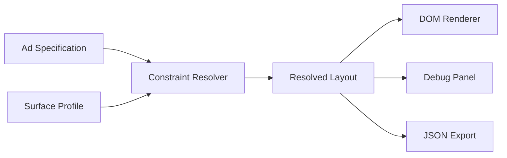
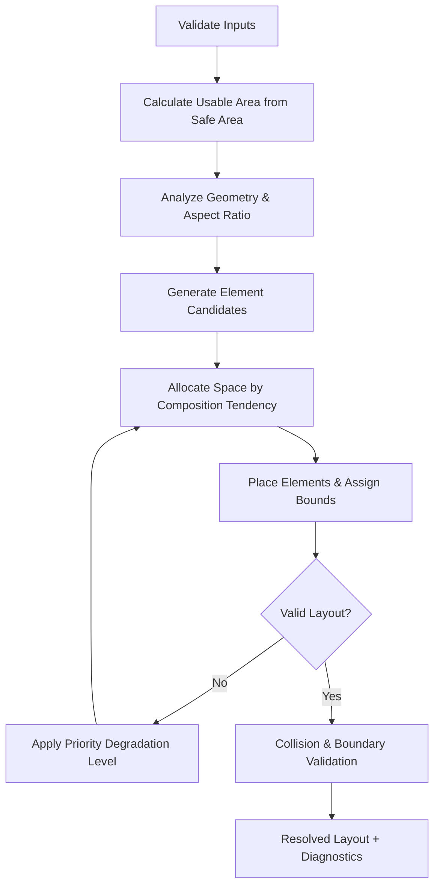

# Architecture Document: Adaptive Layout Engine

This document outlines the technical architecture, domain models, algorithm design, and engineering tradeoffs of the **Adaptive Layout Engine for Multi-Surface Ads**.

---

## 1. Problem Statement

Modern digital advertising surfaces range from compact smart watches and mobile displays to ultrawide TV broadcasts and high-resolution interactive kiosks. 

Traditional approaches rely on either:
1. **Hardcoded Templates per Surface**: Brittle, expensive to maintain, and requires engineering deployments for every new display specification.
2. **CSS Media Queries**: Tied directly to web browser viewports, incapable of handling headless server-side ad generation or physical constraints (e.g. 10-foot viewing distance on TV vs. near-field touch).
3. **Uniform Scaling**: Produces unreadable text on far-field displays and unusable touch targets on public kiosks.

The goal is to design a **deterministic, constraint-driven layout engine** that receives **one declarative advertisement specification** and produces an optimal, collision-free layout for any surface profile without surface-specific branching.

---

## 2. Design Goals

* **Generic Resolution**: No branching on `surface.id` or `surface.name`.
* **Mathematical Explainability**: Predictable positioning derived from aspect ratio, usable area, and element weights.
* **Deterministic Priority Degradation**: Guaranteed protection of critical content (`P1`) by systematically pruning or shrinking lower-priority items (`P3`).
* **Framework Independence**: The layout resolver is plain TypeScript with zero DOM or React dependencies, making it portable to Node.js, Web Workers, Canvas backends, or mobile runtimes.
* **Physical Constraint Adherence**: Hard adherence to minimum tap targets and minimum readable font sizes.

---

## 3. Non-Goals

* **Arbitrary CSS Engine**: The engine does not emulate CSS Flexbox or CSS Grid specifications; it computes concrete pixel coordinates `(x, y, width, height)`.
* **Full Simplex/Cassowary Linear Programming**: A full Cassowary solver introduces significant memory overhead, non-deterministic performance, and complex debugging. Instead, a priority-aware greedy box solver is used.
* **Pixel-Level Kerning**: Uses proportional font metrics rather than browser font rasterization.

---

## 4. System Architecture



### Decoupling of Concerns
* `src/engine/`: Pure domain types, geometry functions, constraint models, degradation pipeline, and solver logic.
* `src/renderers/`: Translates resolved spatial coordinates into DOM nodes with CSS styling.
* `src/components/`: Interactive playground, visual debug tools, and surface builders.

---

## 5. Resolver Data Flow



---

## 6. Ad Specification Model

The advertisement specification is declarative and immutable. Elements use a discriminated union on `type`:

```typescript
export type ElementType = 'text' | 'image' | 'button';
export type ElementRole = 'primary' | 'secondary' | 'hero' | 'action' | 'branding';
export type ElementPriority = 1 | 2 | 3;

export interface BaseElement {
  id: string;
  role: ElementRole;
  priority: ElementPriority;
}

export interface TextElement extends BaseElement {
  type: 'text';
  content: string;
  styleHint?: { accent?: boolean; badge?: boolean };
}

export interface ImageElement extends BaseElement {
  type: 'image';
  src: string;
  alt?: string;
  aspectRatio?: number;
}

export interface ButtonElement extends BaseElement {
  type: 'button';
  content: string;
  variant?: 'primary' | 'secondary';
}

export type AdElement = TextElement | ImageElement | ButtonElement;
```

---

## 7. Surface Constraint Model

A surface profile represents a physical screen canvas:

```typescript
export interface SurfaceProfile {
  id: string;
  name: string;
  width: number;
  height: number;
  safeArea?: {
    top: number;
    right: number;
    bottom: number;
    left: number;
  };
  minTextSize?: number;
  minTapTarget?: number;
  touchOnly?: boolean;
  viewingDistance?: 'near' | 'medium' | 'far';
  maxElements?: number;
  density?: 'compact' | 'normal' | 'spacious';
}
```

---

## 8. Layout Resolution Algorithm

### Step 1: Input Validation
`validateAdSpec()` and `validateSurfaceProfile()` check schema correctness, positive dimensions, unique IDs, and valid safe areas before computation starts.

### Step 2: Usable Bounds Calculation
Safe area insets are subtracted:
$$\text{usableWidth} = \text{width} - \text{safeArea.left} - \text{safeArea.right}$$
$$\text{usableHeight} = \text{height} - \text{safeArea.top} - \text{safeArea.bottom}$$

### Step 3: Geometry Classification
The composition tendency is computed strictly from the usable aspect ratio:
$$\text{aspectRatio} = \frac{\text{usableWidth}}{\text{usableHeight}}$$

* **Vertical Flow** ($\text{aspectRatio} < 0.85$): Elements stack vertically in priority order: Branding $\to$ Hero visual $\to$ Primary headline $\to$ Secondary value $\to$ Bottom anchored CTA.
* **Horizontal Flow** ($\text{aspectRatio} > 1.90$): Elements arrange along a horizontal ribbon with leading anchors (Branding/Hero), central typography corridor, and trailing interactive CTA anchor.
* **Balanced Flow** ($0.85 \le \text{aspectRatio} \le 1.90$): Divides screen into complementary quadrants or a balanced two-column stage (Hero visual on one side/stage, typography and CTA on the counterpart).

### Step 4: Candidate Normalization
Translates `AdElement` into `LayoutCandidate` instances with preferred/minimum bounds and distance multipliers:
* Far viewing distance applies a $1.65\times$ font multiplier.
* Touch surfaces enforce `minTapTarget` minimum bounding box on buttons.

---

## 9. Priority System & Semantic Roles

| Role | Typical Priority | Spatial Behavior | Shrinkability | Droppability |
| :--- | :---: | :--- | :---: | :---: |
| `hero` | 1 | Preserves aspect ratio; occupies major visual focus | Moderate | Never |
| `primary` | 1 | Headline; high typographic emphasis | Low | Never |
| `action` | 1 or 2 | Interactive button; respects minimum tap target | Zero | Protected |
| `secondary` | 2 | Price badge or supporting copy; can truncate | High | At Level 7 |
| `branding` | 3 | Logo mark; flexible scaling | Very High | At Level 5 |

---

## 10. Deterministic Degradation Algorithm

When the solver detects boundary overflow or collision at level $k$, it increments to level $k+1$:

```
Level 0: Full preferred sizes and default spacing
   ↓ (overflow detected)
Level 1: Compress layout gaps and padding by 40%
   ↓
Level 2: Shrink lower-priority branding elements (P3)
   ↓
Level 3: Reduce secondary text font size towards surface.minTextSize
   ↓
Level 4: Truncate secondary text to single line with ellipsis
   ↓
Level 5: Drop lowest priority branding elements (P3)
   ↓
Level 6: Compress hero image dimensions towards minimum bound
   ↓
Level 7: Drop priority 2 secondary copy to protect headline and CTA
```

Every degradation event creates a structured diagnostic record containing `elementId`, `action`, `reason`, `priority`, and `level`.

---

## 11. Geometry & Collision Validation

To ensure structural integrity, the engine performs rigorous post-solve checks:

1. **AABB Intersection (`intersects`)**:
   $$\text{overlap} = (x_1 < x_2 + w_2) \land (x_1 + w_1 > x_2) \land (y_1 < y_2 + h_2) \land (y_1 + h_1 > y_2)$$
2. **Bounds Containment (`isInsideBounds`)**:
   $$\text{contained} = (x \ge x_{\text{bounds}}) \land (y \ge y_{\text{bounds}}) \land (x + w \le x_{\text{bounds}} + w_{\text{bounds}}) \land (y + h \le y_{\text{bounds}} + h_{\text{bounds}})$$
3. **Touch Invariant**:
   For any interactive button on touch surfaces:
   $$w_{\text{button}} \ge \text{minTapTarget} \quad \text{and} \quad h_{\text{button}} \ge \text{minTapTarget}$$
4. **Legibility Invariant**:
   For all text elements:
   $$\text{fontSize} \ge \text{surface.minTextSize}$$

---

## 12. Rendering Abstraction

The DOM renderer (`src/renderers/DomRenderer.tsx`) is a passive consumer of `ResolvedLayout`:
* Elements are positioned via absolute coordinates: `left: ${x}px`, `top: ${y}px`, `width: ${width}px`, `height: ${height}px`.
* Safe areas and visual debug bounds are toggled cleanly via props.
* Auto-fit scaling utilizes CSS transforms (`transform: scale(...)`) with `transformOrigin: top left` to prevent parent card clipping while preserving exact aspect ratios.

---

## 13. Extensibility: Supporting Unknown Surfaces

Because the solver uses generic geometry and constraint metrics, adding a new surface profile requires only declaring its constraint parameters:

```typescript
const inCarDashboard: SurfaceProfile = {
  id: 'in-car-dash',
  name: 'Automotive Center Display',
  width: 1280,
  height: 720,
  safeArea: { top: 30, right: 40, bottom: 30, left: 40 },
  minTextSize: 20,
  minTapTarget: 56,
  touchOnly: true,
  viewingDistance: 'medium',
  density: 'normal',
};
```

Zero modifications are needed in `resolver.ts`.

---

## 14. Testing Strategy

The test suite in `tests/resolver.test.ts` validates the 8 required interview criteria:
* **TEST 1**: Mobile Portrait resolves without overlap.
* **TEST 2**: Mobile Landscape resolves without overlap.
* **TEST 3**: Broadcast Lower Third respects `minTextSize` (22px).
* **TEST 4**: Kiosk CTA respects `minTapTarget` (60px).
* **TEST 5**: Every visible element on every surface remains within safe bounds.
* **TEST 6**: Constrained surface drops lower-priority (`P3`) logo before `P1` headline/hero.
* **TEST 7**: Pairwise collision check (`findOverlaps`) returns 0 across all profiles.
* **TEST 8**: Unknown custom surface resolves accurately with safe area and text constraints.
* **Input Validation**: Throws clear errors on invalid inputs (duplicate IDs, negative dimensions).

---

## 15. Tradeoffs

| Choice | Advantage | Tradeoff |
| :--- | :--- | :--- |
| **Greedy Priority Solver vs. Cassowary** | Highly explainable during interviews; sub-millisecond execution time; zero external dependencies. | Complex multi-directional circular constraints are not supported. |
| **Proportional Font Metrics vs. Canvas Kerning** | Instant calculation in Node.js or web without DOM/Canvas context. | Font metrics are estimates (~5% variance with custom web fonts). |
| **Absolute Coordinate Output vs. Flexbox CSS** | Complete deterministic control; renderable in Canvas, SVG, or Native; easily testable. | Requires the engine to compute line wrapping and stacking explicitly. |
